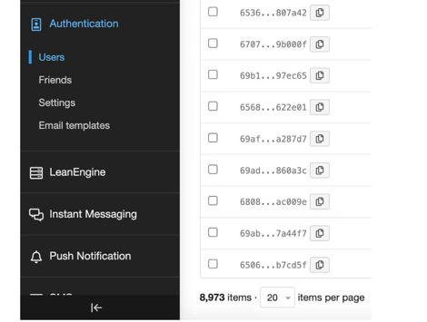
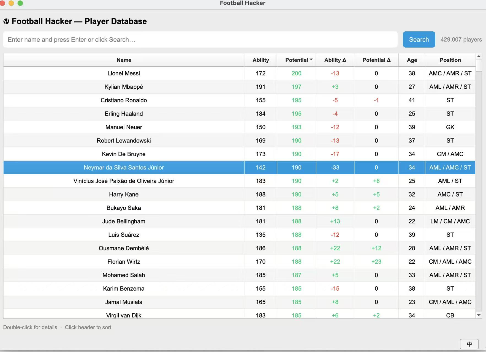
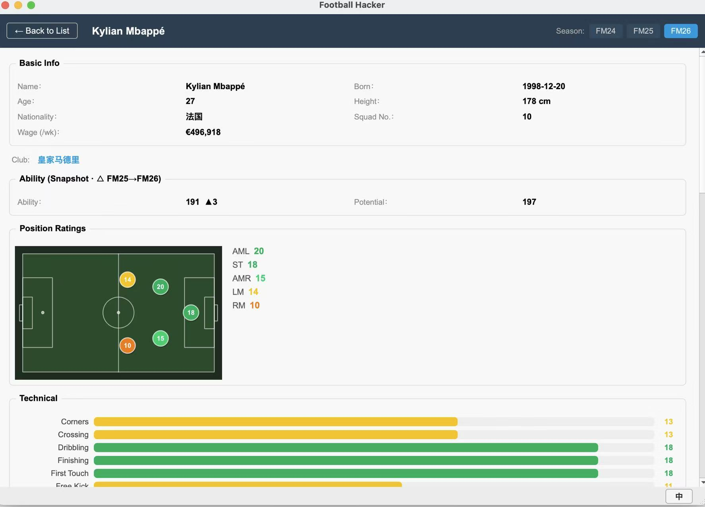
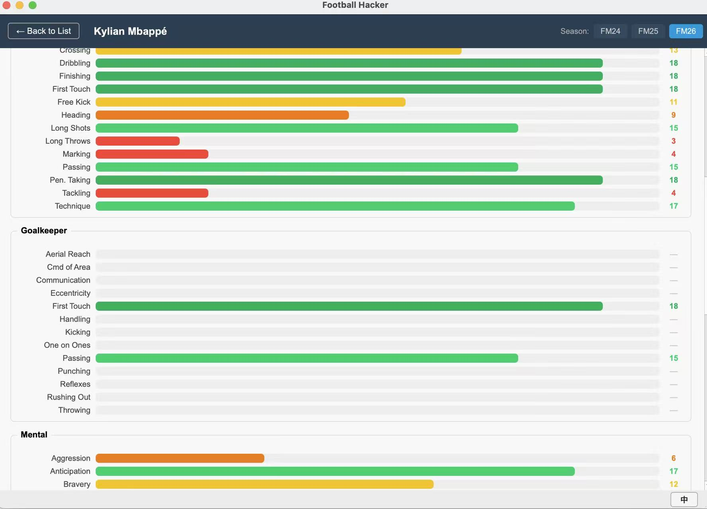
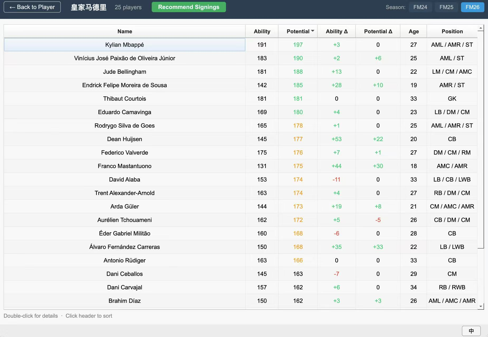
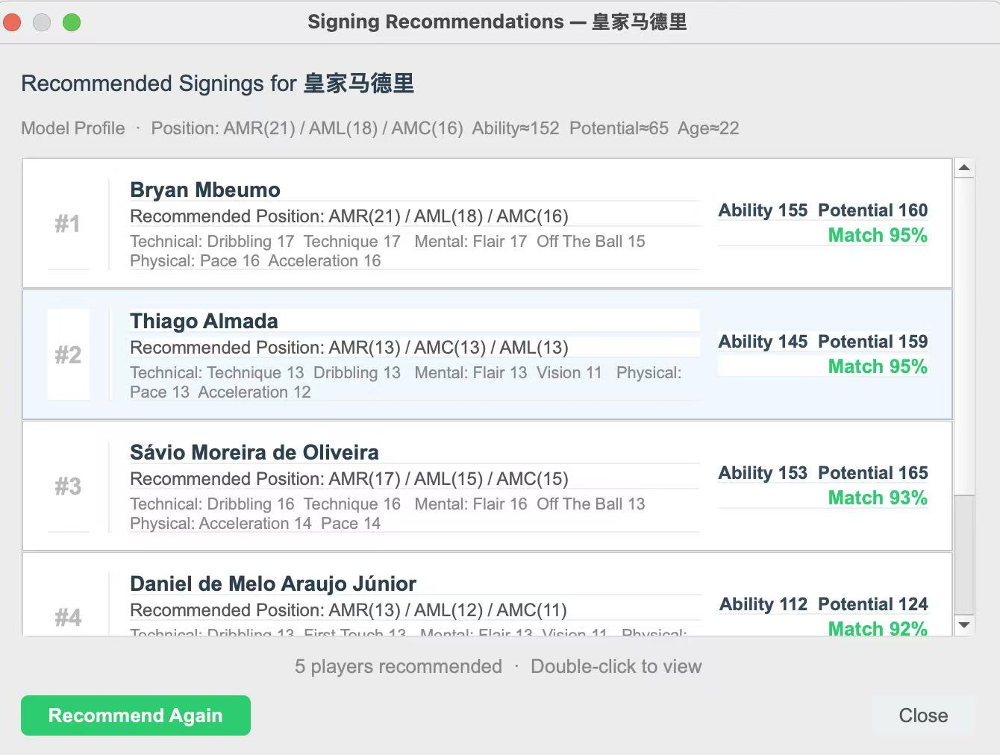

# ⚽ Football Hacker — Professional Edition (MVP)

> **From the fan community to the dugout.**
> A data analytics and AI-powered recruitment tool designed for football clubs and professional analysts.

---

## Background

Football Hacker started as a **fan-facing player database browser** built for the football simulation community. The Chinese edition quickly became popular, accumulating about **9,000 active users**:



The **Professional Edition** is the next evolution — rebuilt from the ground up with multi-language support, deep attribute analytics across multiple seasons, and an AI-powered signing recommendation engine trained on real transfer patterns of top European clubs.

Our goal is to move beyond traditional stat spreadsheets and give football clubs a **professional recruitment analytics tool** — combining rich player data with modern neural network AI.

---

## Features

### 1. Player Search & Database

Browse and search across **400,000+ player records**. Sort by ability, potential, age, or position. Delta columns show season-over-season changes at a glance.



---

### 2. Full Attribute Profile

Double-click any player to open their complete profile. View all attribute groups — Technical, Goalkeeping, Mental, Physical, and Personality — with colour-coded bar charts. Switch between **2024 / 2025 / 2026** snapshots to track development, with automatic ▲▼ change indicators.




**Attribute groups covered:**

| Group | Attributes |
|---|---|
| **Technical** | Dribbling, Passing, Finishing, First Touch, Tackling, Technique… |
| **Goalkeeping** | Reflexes, Aerial Reach, One on Ones, Handling, Kicking… |
| **Mental** | Decisions, Composure, Vision, Anticipation, Concentration… |
| **Physical** | Pace, Acceleration, Stamina, Strength, Agility… |
| **Personality** | Professionalism, Ambition, Temperament, Adaptability… |

---

### 3. Club Roster View

Navigate to any club's full squad. Sort, filter, and drill into individual profiles. The **Recommend Signings** button is right in the toolbar — one click away.



---

### 4. AI Signing Recommendations

Click **Recommend Signings** and the neural network analyses the current squad composition, generates an ideal signing profile, and returns a ranked shortlist from 28,000+ candidates — with match scores and key attribute breakdowns.



Each result shows:
- **Recommended positions** with ratings
- **Key attributes** across Technical, Mental, and Physical groups
- **Ability / Potential** values
- **Match %** — cosine similarity between the generated profile and the candidate

Hit **Recommend Again** to get a fresh shortlist. The model samples from a probabilistic latent space, so each run produces diverse, non-identical candidates.

---

## How the AI Works

The recommendation engine is a **Squad VAE (Variational Autoencoder)**. Each player is encoded into an **82-dimensional attribute vector** (position ratings + technical + mental + physical + hidden personality attributes), then the squad is aggregated via Multi-Head Attention into a single representation.

```
Current Squad (N players)
        │
  Player Encoder              82-dim attribute vector per player
  (MLP + LayerNorm)           embedded into 64-dim space
        │
  Squad Aggregator            Multi-Head Attention pools the full
  (Attention + Residual)      squad into one representation
        │
  VAE Latent Space            Encodes squad context as a probability
  (μ, σ  →  sample z)         distribution — the source of randomness
        │
  Profile Decoder             Generates an ideal signing profile:
  (MLP)                       position, technical, physical, mental
        │
  Cosine Similarity Search    Finds the closest real player in the
  (28,000+ candidates)        database to the generated profile
```

**Training:** The model was trained on the transfer histories of **18 top European clubs** across three seasons. The loss function maximises cosine similarity between each generated profile and the club's actual signings — so the model learns what kinds of players top clubs tend to acquire given their existing squad.

**Randomness by design:** Each call samples a different point from the VAE's latent distribution. A `temperature` parameter controls how exploratory vs. conservative the recommendations are.

---

## Quickstart

**Requirements:** Python 3.11+, PyQt5, PyTorch, NumPy

```bash
pip install pyqt5 torch numpy

cd football_viewer
python main.py
```

---

## Roadmap

- [ ] Export shortlists to PDF / CSV
- [ ] Squad gap analysis (identify missing roles automatically)
- [ ] Player similarity search ("find players like X")
- [ ] Club-facing API

---

*Football Hacker Professional Edition is built for clubs and analysts who want more than a spreadsheet. If you are interested in a partnership or a demo, get in touch.*
